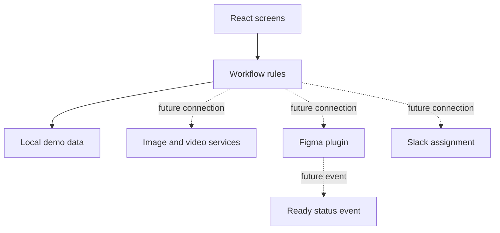

# Technical architecture

## Current demo

The app uses React 19, Vite 8, plain CSS, and local sample data. The main code areas are:

- `src/screens/` — complete workflow screens.
- `src/components/` — reusable interface and preview pieces.
- `src/domain/` — rules for campaign and review status changes.
- `src/data/` — sample campaigns, templates, and visuals.
- `src/test/` — test setup and shared test helpers.

The demo keeps its data in React state. Nothing is saved to a backend in V1. If a checklist mark is added, it is local to the current browser session.

## Where future integrations connect

The dotted connections are placeholders. They are not working network integrations in the current V1 demo.

## Build and hosting

1. `npm run build` builds the React app into `dist/`.
2. The same command builds these documentation pages into `dist/docs/`.
3. Nginx serves the app at `/` and the documentation at `/docs/`.
4. The public demo runs on Cloud Run in `europe-west6`.

## Change rules

- If a workflow status changes, update its test and this page.
- If a public URL changes, add a route test and check the Nginx fallback.
- If a template rule changes, update the template manifest and review examples.
