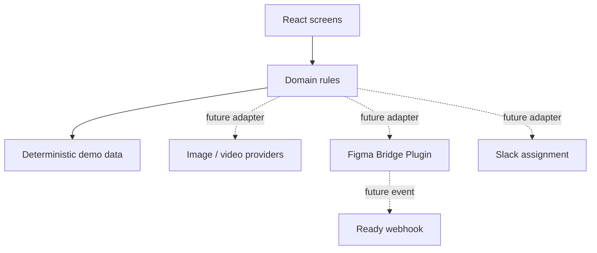

# Техническая архитектура

## Runtime и структура кода

React 19 + Vite 8, plain CSS и deterministic local data. Основные границы кода:

- `src/screens/` — route-level workflow surfaces.
- `src/components/` — reusable UI and preview components.
- `src/domain/` — campaign and review state rules.
- `src/data/` — demo campaigns, templates and visuals.
- `src/test/` — jsdom setup and component test support.

State живёт в React state; checklist-подобные пользовательские отметки, если нужны, явно помечаются как local-only. Backend persistence в V1 нет.

## Границы интеграций

Пунктирные узлы не являются рабочими сетевыми интеграциями текущего V1.

## Сборка и hosting

1. `npm run build` собирает React app в `dist/`.
2. Тот же build запускает `vitepress build docs-site --outDir dist/docs`.
3. Docker builder выполняет production build, nginx отдаёт `/docs/` как статические файлы.
4. Cloud Run service `lingu-studio` работает в `europe-west6`.

## Change contract

Изменение state transition требует теста на transition и обновления этой страницы. Изменение public route требует route test и проверки nginx fallback.
