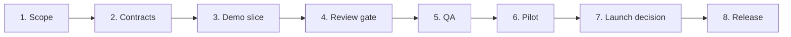

# MVP launch roadmap

This roadmap is the step-by-step path from the current demo to a launchable MVP. Complete each phase in order. A phase is complete only when its exit check passes.

The checkboxes are personal. Click them as you work; your progress is saved in this browser and is not shared with the team.

## At a glance

## Phase 1 — Lock the scope

**Owner:** Whole team  
**Goal:** Agree on the one workflow the MVP must prove.

### Checklist

- [ ] Choose one campaign type and one delivery format for the pilot. Whole team
- [ ] Write the happy path: brief → copy → image ideas → templates → review → approval → delivery. Ira
- [ ] List what is explicitly out of scope: real provider jobs, billing, multi-team accounts, and non-essential integrations. Roman
- [ ] Record the decision in the team log. Whole team

**Exit check:** Everyone can describe the same workflow and the same V1 limits.

## Phase 2 — Agree on the contracts

**Owners:** Ira, Vlad, Roman  
**Goal:** Define what each step needs and returns before implementation changes.

### Checklist

- [ ] Document screen states: loading, empty, error, retry, blocked, and success. Ira
- [ ] Document template slots, safe areas, sizes, ratios, and content limits. Vlad
- [ ] Document campaign, copy, image, template, review, and delivery data formats. Roman
- [ ] Agree on status names and who may change each status. Whole team
- [ ] Add one example payload for the pilot campaign. Roman

**Exit check:** A designer can review the examples, and an engineer can validate the data without guessing.

## Phase 3 — Build the repeatable demo slice

**Owner:** Roman  
**Goal:** Make the full happy path work with local sample data.

### Checklist

- [ ] Connect the screens to the agreed status flow. Roman
- [ ] Add predictable demo actions for copy, image ideas, and banner compositions. Roman
- [ ] Keep every result tied to a campaign and a version. Roman
- [ ] Review clear progress, errors, retry actions, and blocked states. Ira
- [ ] Add tests for the main status changes and the public documentation route. Roman

**Exit check:** Repeating the same demo action produces the same result and status.

## Phase 4 — Add the human review gate

**Owners:** Vlad, Roman  
**Goal:** Make designer and marketer approval explicit.

### Checklist

- [ ] Create a locked review package from the current composition. Roman
- [ ] Send the package to the Figma review flow. Roman
- [ ] Mark reviewed frames `Ready for Development`. Vlad
- [ ] Record the approved version; do not silently replace it after approval. Roman
- [ ] Allow delivery only from that exact approved version. Roman

**Exit check:** A changed composition creates a new version and requires another review.

## Phase 5 — Run product and quality checks

**Owners:** Ira, Roman  
**Goal:** Remove blockers before anyone outside the team sees the MVP.

### Checklist

- [ ] Check the main screens on desktop and mobile sizes. Ira
- [ ] Check keyboard navigation, focus, labels, and readable error messages. Ira
- [ ] Test empty, error, retry, blocked, and stale states. Roman
- [ ] Test unsafe AI output handling and rejection messages. Roman
- [ ] Test PNG / MP4 / ZIP export from an approved version. Roman
- [ ] Fix all launch-blocking issues and record known limitations. Whole team

**Exit check:** No launch-blocking issue remains in the happy path or its recovery states.

## Phase 6 — Run a pilot

**Owners:** Ira, Vlad  
**Helpers:** Roman, marketer  
**Goal:** Prove that the workflow works with realistic content.

### Checklist

- [ ] Select three to five representative campaigns. Ira
- [ ] Run each campaign from brief to delivery without changing the data by hand. Roman
- [ ] Complete the Figma review and approve the exact version. Vlad + Marketer
- [ ] Record time spent, blocked steps, unclear labels, and missing information. Ira
- [ ] Turn repeated problems into tasks; do not hide them in the demo. Whole team

**Exit check:** The pilot dataset completes the happy path and the team has a written list of remaining limits.

## Phase 7 — Make the launch decision

**Owner:** Whole team  
**Goal:** Decide whether the MVP is safe to show or needs another cycle.

### Checklist

- [ ] Review the pilot results and all open launch gates. Whole team
- [ ] Confirm that the demo does not claim unavailable integrations. Roman
- [ ] Confirm that designer review cannot be bypassed and approval is required. Ira + Marketer
- [ ] Choose one decision: `Go`, `Go with known limits`, or `No-go`. Whole team
- [ ] Record the decision, owner, and next review date. Whole team

**Exit check:** The decision is written down and every open issue has an owner.

## Phase 8 — Release and observe

**Owner:** Roman  
**Helpers:** Whole team  
**Goal:** Publish one traceable build and watch the first uses.

### Checklist

- [ ] Run the production build and route checks. Roman
- [ ] Deploy the tagged build to Cloud Run. Roman
- [ ] Open the public app and documentation on desktop and mobile. Ira
- [ ] Run one final campaign through the public build. Whole team
- [ ] Share the known-limitations list with the pilot users. Ira
- [ ] Collect feedback in the decision log and schedule the next review. Whole team

**Exit check:** The public build works, the docs match the product, and the first pilot run is traceable.

## Launch checklist

- [ ] Scope and V1 limits are written down.
- [ ] Screen, template, and data contracts are agreed.
- [ ] Happy path works with repeatable sample data.
- [ ] Designer review and marketer approval are required.
- [ ] Recovery states and safety checks are tested.
- [ ] Responsive and accessibility checks are complete.
- [ ] Pilot campaigns finish without manual data replacement.
- [ ] Known limitations have owners.
- [ ] Go/no-go decision is recorded.
- [ ] Public build and documentation are verified.
