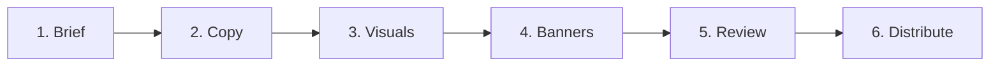

# Workflow

## Approved workflow

The application now uses six modules. Each block can keep its own draft, loading state and errors while the page connects the workflow. Older eight-step links still resolve to the matching module.

## Steps

| Step | Current functionality grouped here |
| --- | --- |
| Brief | Paste a description or attach a file; analyze it and refine the summary and facts |
| Copy | Review the first five options, approve options, remove options, or generate more |
| Visuals | Prepare prompts; explicitly generate images or upload them, then select a visual |
| Banners | Select designs and output sizes; validate their content before preparing review files |
| Review | Prepare an immutable version, add the Figma review link and designer checks, request changes or approve |
| Distribute | Build and download the approved version's PNG package and manifest |

Each module owns its functionality and state, receives defined inputs, and provides defined outputs. Modules must support independent development and debugging. The page connects them in this order using shared workflow coordination.

Brief analysis prepares the first Copy options and text-only visual prompts. Images are generated only after an explicit action. Figma import/linking remains manual; distribution does not yet publish to advertising platforms. See [Campaign modules](/campaign-modules) for development boundaries and test commands.

## Do not skip a step

Grouping review and approval into one module does not remove the existing review gates. Distribution requires an approved version. Revised creative needs another review round; approved versions retain their original content.
