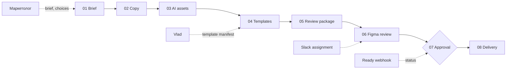

# Рабочий процесс

## Golden path

## Stages

| Stage | Input | Output | Gate |
| --- | --- | --- | --- |
| Brief | Свободный контекст кампании | Campaign record | Brief достаточен для старта |
| Copy | Brief | Headline, body, offer, CTA, prompts | Marketer выбирает или редактирует |
| AI assets | Visual prompt | Пять visual directions | Направление выбрано |
| Templates | Template manifest + выбранный visual | Banner compositions | Slots, ratios и limits валидны |
| Review package | Immutable composition snapshot | Пакет для дизайнера | Версия зафиксирована |
| Figma review | Review package | Edited frames + Ready status | Designer ставит `Ready for Development` |
| Approval | Ready snapshot | Explicit marketer approval | Exact snapshot подтверждён |
| Delivery | Approved snapshot | PNG / MP4 / ZIP | Только после approval |

## Переходы нельзя пропускать

Delivery не запускается из draft состояния. Любые изменения после создания review package требуют новой версии package и повторного review.
