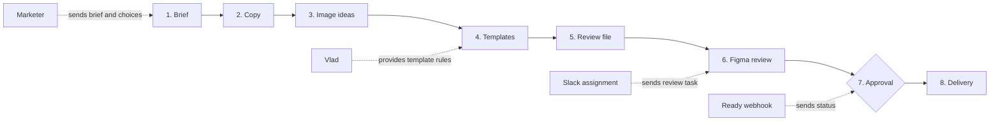

# Workflow

## The happy path

The happy path is the one complete route a campaign must follow. A step cannot be skipped.

## Steps

| Step | What goes in | What comes out | Who confirms it |
| --- | --- | --- | --- |
| Brief | Campaign context | Campaign record | Marketer confirms the brief is clear enough to start |
| Copy | Brief | Headline, body, offer, call to action, prompts | Marketer selects or edits the copy |
| Image ideas | Visual prompt | Five visual directions | Marketer selects one direction |
| Templates | Template rules + selected direction | Banner compositions | The design fits the allowed slots, ratios, and limits |
| Review file | Locked composition snapshot | Package for the designer | Version is recorded |
| Figma review | Review file | Edited frames + `Ready for Development` status | Designer marks the frames ready |
| Approval | Ready snapshot | Marketer approval | Marketer approves the exact version |
| Delivery | Approved snapshot | PNG / MP4 / ZIP | Export is allowed only after approval |

## Do not skip a step

Delivery cannot start from a draft. Any change after the review file is created needs a new version and another review.
