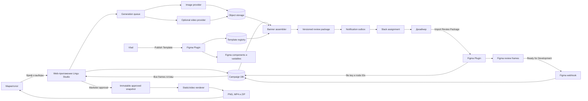
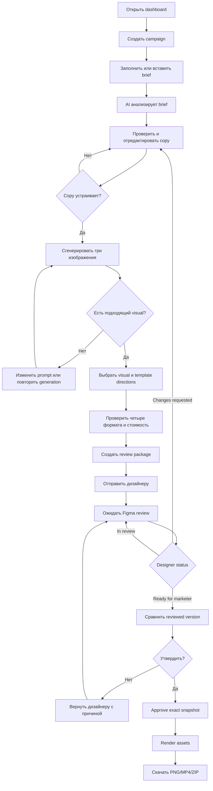
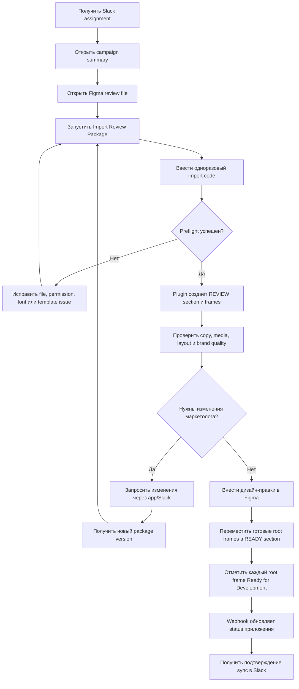

# Lingu Studio MVP: продукт, командная работа и Figma Bridge Plugin

**Статус:** проект спецификации для проверки командой  
**Дата:** 3 сентября 2026  
**Язык продукта в MVP:** русский  
**Рабочее название:** Lingu Studio  
**Ключевое решение:** один приватный Figma Bridge Plugin с командами `Publish Template` и `Import Review Package`

Эта спецификация развивает локальный прототип в подключённый MVP. Если она противоречит ранним документам, описывающим Figma, Slack, генерацию или delivery как симуляции, для подключённого MVP приоритет имеет эта спецификация.

---

## 1. Резюме решения

Lingu Studio — инструмент для производства рекламных баннеров, в котором AI ускоряет подготовку копирайта и визуалов, шаблоны обеспечивают предсказуемую композицию, а дизайнер остаётся обязательной точкой контроля качества.

Для MVP команда строит один правдивый end-to-end сценарий:

1. Маркетолог создаёт кампанию из брифа.
2. Приложение предлагает копирайт и генерирует изображения; видео остаётся опциональным.
3. Маркетолог выбирает контент и 1–3 дизайн-направления.
4. Приложение собирает варианты в 3–5 заранее подготовленных шаблонах и четырёх форматах.
5. Приложение создаёт review package и уведомляет дизайнера в Slack.
6. Дизайнер запускает `Import Review Package` в Figma; плагин создаёт редактируемые frames и сообщает их node IDs приложению.
7. Дизайнер правит баннеры, перемещает готовые варианты в секцию `READY` и отмечает корневые frames как **Ready for Development**.
8. Backend получает Figma webhook и переводит package в `ready_for_marketer`, когда готовы все обязательные frames.
9. Маркетолог утверждает точную проверенную версию.
10. Приложение формирует реальные PNG/MP4 и ZIP-пакет.

Главный принцип организации работы: **не ждать окончания всего дизайна перед началом разработки**. До параллельной работы необходимо зафиксировать контракты между приложением, Figma и UI; затем три потока могут идти независимо.

---

## 2. Что представляет собой продукт

### 2.1. Ценность

Lingu Studio сокращает время от маркетингового брифа до готового к ревью набора баннеров. Он автоматизирует повторяемую производственную работу, но не заменяет решение дизайнера о качестве.

### 2.2. Входные данные

- Свободный маркетинговый бриф.
- Брендовые материалы и ограничения.
- Выбранные Figma-шаблоны и их опубликованные версии.
- При необходимости — пользовательские изображения или логотипы.

### 2.3. Результат

- Отредактированный и утверждённый копирайт.
- Сгенерированные и выбранные изображения; опционально короткое видео.
- Review package с полной трассировкой copy, media и template versions.
- Редактируемые review frames в Figma.
- Подтверждённый дизайнером и маркетологом production snapshot.
- Реальные PNG/MP4-файлы в согласованных размерах и JSON manifest внутри ZIP.

### 2.4. Что приложение делает в MVP

- Анализирует бриф и создаёт структурированный campaign strategy.
- Предлагает несколько вариантов headline, body, offer и CTA.
- Сохраняет ручные изменения как отдельную версию, а не как временное состояние поля.
- Запускает реальные image-generation jobs.
- Позволяет выбрать источник media и template direction.
- Собирает баннеры по опубликованному template manifest.
- Создаёт неизменяемый review package.
- Организует Figma handoff через приватный plugin.
- Отслеживает статусы Figma **Ready for Development**.
- Отправляет полезные, не шумные уведомления в Slack.
- Блокирует финальный delivery до human approval.

### 2.5. Что приложение не делает в MVP

- Не заменяет дизайнера и не утверждает AI-креатив автоматически.
- Не предоставляет свободный графический редактор внутри web app.
- Не выводит полноценную дизайн-систему из любых случайных картинок. Дизайн-система извлекается только из структурированных Figma components и variables после явной публикации.
- Не синхронизирует каждое изменение Figma в реальном времени.
- Не рендерит видео внутри Figma plugin.
- Не публикует кампании напрямую в рекламные кабинеты.
- Не гарантирует юридическую корректность claims без human review.
- Не поддерживает marketplace, billing, несколько организаций и сложную матрицу permissions.
- Не обещает zero-click создание frames: дизайнер один раз запускает импорт в Figma.

### 2.6. Как доказать ценность MVP

Пилот должен сравнить одинаковые задачи с текущим ручным процессом. Рекомендуемая продуктовая цель:

- review-ready пакет из четырёх форматов создаётся не более чем за 10 минут активного времени;
- активное производственное время сокращается минимум на 50% по медиане десяти пилотных кампаний;
- отдельно измеряются число ручных исправлений, процент принятых визуалов, review loops, generation failures и стоимость.

---

## 3. Пользователи продукта и участники команды

### 3.1. Пользовательские роли

#### Маркетолог — основная роль

Маркетолог создаёт кампанию, принимает решения по copy и media, отправляет пакет дизайнеру и подтверждает финальную версию. Он не обязан понимать устройство Figma components или AI providers.

#### Дизайнер — вторичная роль

Дизайнер получает назначение, импортирует package в Figma, вносит профессиональные изменения и отмечает готовые frames. В самом web app ему нужен только минимальный read-only контекст; его основная рабочая среда — Figma и Slack.

### 3.2. Командные роли

| Участник | Основная зона ответственности | Право финального решения | Обязательные артефакты |
|---|---|---|---|
| **Roman** | Product implementation, архитектура, data contracts, GenAI jobs, Figma/Slack integration, rendering, tests | Техническая архитектура и реализация в рамках утверждённых контрактов | API/schema, state machine, plugin/backend, working vertical slice, test evidence |
| **Ira** | UX/UI, information architecture, flow, интерфейсный copy, states, accessibility, design-engineering QA | UX flow, UI behavior и пользовательская терминология | Wireflows, screen/state matrix, component specs, copy deck, responsive/a11y acceptance |
| **Vlad** | Visual design, brand expression, banner templates, Figma variables/components, visual QA | Визуальная система и готовность template versions | Figma library, token set, 3–5 template directions, four-ratio variants, template QA |
| **Вся команда** | MVP scope, success metrics, review SLA, acceptance | Go/no-go по пилоту | Approved spec, decision log, pilot checklist |

### 3.3. Границы ответственности

- Ira определяет **как пользователь понимает и проходит процесс**; она не должна ждать готового backend для проектирования состояний.
- Vlad определяет **как выглядит и ведёт себя banner template**; он не проектирует API и не настраивает generation providers.
- Roman определяют **как система сохраняет, генерирует, импортирует и подтверждает данные**; реализация не должна незаметно менять утверждённые UX-copy или visual tokens.
- Изменение общего контракта требует короткого decision note и подтверждения затронутых владельцев.

---

## 4. Можно ли работать параллельно

Да. Оптимальная модель — три параллельных потока после короткого contract sprint.

### 4.1. Контракты, которые нужно зафиксировать первыми

| Contract | Что фиксируется | Владельцы подтверждения |
|---|---|---|
| **C1. Campaign lifecycle** | Названия и переходы состояний, кто имеет право на каждый переход | Ira + Roman |
| **C2. Template Manifest v1** | Slots, ratios, component keys, constraints, tokens, versioning | Vlad + Roman |
| **C3. Review Package v1** | Copy/media/template versions и список обязательных variants | Roman + Vlad |
| **C4. UI State Matrix** | Loading, empty, success, partial failure, blocked, stale, ready | Ira + Roman |
| **C5. Figma Handshake** | Import code, node mapping, webhook, idempotency, stale check | Roman + Vlad |
| **C6. Product language** | Русские labels, notifications и status copy | Ira + вся команда |

После утверждения C1–C6:

- Ira может проектировать и полировать UI на mock data и стабильных state names.
- Vlad может собирать Figma library и templates по Template Manifest v1.
- Roman и Codex могут строить backend, jobs, plugin и integration tests по тем же contracts.

### 4.2. Как избегать конфликтов

- UI получает typed view models; UI не читает provider responses напрямую.
- App/backend не интерпретирует имена произвольных Figma layers; он читает опубликованный manifest.
- Plugin не содержит business state machine; он выполняет команды и сообщает результат.
- Slack не является source of truth; каждое сообщение порождается состоянием в базе.
- Активная кампания всегда закреплена за конкретными copy, media и template versions.

### 4.3. Точки синхронизации

1. **Contract review:** C1–C6 утверждены.
2. **Reference-template review:** один template проходит publish → import → Ready webhook.
3. **Vertical-slice review:** один brief → одно image → один template → четыре Figma frames → approval → PNG delivery.
4. **MVP review:** 3–5 templates, failure paths, Slack и optional video.
5. **Pilot go/no-go:** измерения, security checklist и recovery tests пройдены.

---

## 5. Артефакты до начала feature implementation

Не требуется завершать весь high-fidelity design. Требуется завершить минимальный набор, без которого параллельная работа создаст переделки.

### 5.1. Обязательные blockers

| Артефакт | Владелец | Критерий готовности |
|---|---|---|
| Product boundary и MVP/non-MVP | Вся команда | Нет спорных feature promises; разделы 2 и 6 утверждены |
| Marketer и Designer journeys | Ira | Happy path и возврат на доработку имеют однозначные states/actions |
| Campaign state machine | Ira + Roman | Каждый переход имеет actor, precondition и result |
| Screen inventory и low-fi wireflow | Ira | Для каждого состояния известен экран, primary action и fallback |
| UI state/copy matrix | Ira | Есть loading, empty, failure, retry, stale, waiting и success copy |
| Figma library skeleton | Vlad | Pages, variable collections, naming и component hierarchy созданы |
| Template Manifest v1 | Vlad + Roman | Все поля и validation rules утверждены |
| Один reference template в четырёх форматах | Vlad | Успешно публикуется и импортируется без ручного исправления структуры |
| Review Package v1 | Roman + Codex | Payload покрывает exact copy/media/template versions |
| Plugin handshake | Roman + Codex | One-time code, API endpoints, mapping и retry behavior определены |
| Figma integration access | Roman | Подтверждены plan capabilities, REST credentials, webhook context и review-file permissions |
| GenAI provider decision | Roman | Выбраны один image provider и один optional video provider; известны limits/costs |
| Safety and rights checklist | Roman + Ira | Блокирующие и предупреждающие проверки имеют понятный UX |
| Slack routing | Roman + команда | Определены workspace, destination, owner и notification policy |
| Definition of Done | Вся команда | Acceptance criteria и test matrix из разделов 26–27 приняты |

### 5.2. Что можно делать параллельно с разработкой

- High-fidelity polish остальных экранов.
- Оставшиеся 2–4 templates после reference template.
- Дополнительные motion presets.
- Подробная документация дизайн-системы.
- Тонкая настройка prompts и provider parameters.
- Иллюстрации, empty states и onboarding polish.

### 5.3. Definition of Ready для начала vertical slice

Feature implementation начинается, когда выполнены все условия:

- C1–C6 зафиксированы в одной версии спецификации.
- Ira утвердила low-fi marketer flow и plugin UI flow.
- Vlad предоставил один published reference template.
- Review Package v1 и Template Manifest v1 имеют JSON examples и validation rules.
- Выбран image provider и установлен campaign spend cap.
- Созданы тестовый Slack destination и тестовый Figma review file.
- На фактическом Figma plan подтверждены REST export, webhooks и событие `DEV_MODE_STATUS_UPDATE`.
- Команда согласовала one-click plugin handoff.

---

## 6. Scope MVP

### 6.1. Обязательно

- Один workspace и минимальные роли marketer/designer/admin.
- Одна сохраняемая campaign с versioned brief и copy.
- Три real image candidates на одно выбранное prompt direction.
- До трёх selected creative directions на review package.
- Четыре формата: 1080×1080, 1080×1350, 1080×1920, 1200×628.
- Три–пять опубликованных templates.
- Private Figma Bridge Plugin с двумя командами.
- Slack assignment и thread updates.
- Figma `READY_FOR_DEV` status sync.
- Marketer confirmation точной reviewed version.
- Настоящие PNG assets и ZIP manifest.
- Optional image-to-video за feature flag.

### 6.2. После MVP

- Все двадцать templates.
- Multi-provider routing.
- Live Figma sync.
- Comments sync между Figma, Slack и app.
- Полноценный in-app editor.
- Ad-platform publishing.
- Billing, marketplace и multi-organization controls.
- Автоматическое создание templates из неструктурированных баннеров.

---

## 7. Общая логика приложения



### 7.1. Campaign lifecycle

```text
draft
→ generating
→ assembled
→ awaiting_figma_import
→ importing
→ in_review
→ ready_for_marketer
→ approved
→ rendering
→ delivered
```

Дополнительные состояния: `changes_requested`, `partially_failed`, `failed`, `canceled`, `stale`.

Правила:

- Только маркетолог переводит `ready_for_marketer → approved`.
- Только Figma webhook по всем обязательным root frames переводит `in_review → ready_for_marketer`.
- Любое изменение selected copy/media/template после отправки создаёт новый review package.
- Если Figma content отличается от ready snapshot перед approval, package получает `stale`.

---

## 8. User journey: маркетолог



### 8.1. UX-требования к пути маркетолога

- На каждом шаге показывается один primary action.
- Всегда видны выбранные copy version, media и template version.
- Completed означает завершённый артефакт, а не доступность следующего шага.
- Cost подтверждается до дорогой video generation.
- Waiting state показывает владельца, время отправки и ссылку на Figma.
- Approval показывает exact reviewed frames и предупреждает о stale changes.
- Любая ошибка имеет понятный retry без потери успешных результатов.

---

## 9. User journey: дизайнер



### 9.1. UX-требования к пути дизайнера

- Slack message содержит campaign, thumbnail, due time, app link и import instruction.
- Plugin до импорта показывает количество frames, template versions и destination.
- Plugin не закрывается без понятного success/partial failure summary.
- Designer может менять содержимое внутри stable root frame; root node хранит mapping.
- Перемещение в секцию `READY` — визуальная организация, а **Ready for Development** — machine-readable approval signal.
- Designer не обязан открывать отдельный сложный dashboard в приложении.

---

## 10. Что Ira должна подготовить

### 10.1. UX artifacts

- Information architecture приложения.
- Screen inventory для dashboard, campaign, generation, review, approval и delivery.
- Low-fi wireflow для marketer journey.
- Low-fi plugin flow для обеих команд.
- State matrix со всеми lifecycle и failure states.
- Permission matrix: что видит и может marketer/designer/admin.
- Copy deck на русском: labels, helper text, warnings, Slack messages и errors.
- Empty/loading/progress/retry/stale designs.
- Confirmation patterns для generation cost и approval.
- Responsive behavior на desktop и phone width.
- Keyboard, focus, reduced motion и WCAG 2.2 AA acceptance.

### 10.2. UI artifacts

- Component inventory и variants.
- UI token mapping к утверждённой visual system Vlad.
- Behavior specs для stepper, cards, tables, filters, dialogs и notifications.
- Annotation: source, editable state и version для copy/media/template.
- Prototype happy path и два failure paths:
  - generation partially failed;
  - Figma package стал stale перед approval.

### 10.3. Definition of Done Ira

- Новый пользователь может объяснить текущий статус campaign без подсказки.
- Ни одна симуляция не выглядит как реальная completed operation.
- Изменение copy визуально и фактически попадает в banner preview.
- Approval невозможно спутать с designer readiness.
- Все errors предлагают действие, а не только описание проблемы.

---

## 11. Что Vlad должен подготовить

### 11.1. Figma file structure

Рекомендуемая структура library file:

```text
00 — Cover & Documentation
01 — Foundations
02 — Components
03 — Banner Templates
04 — Publish Sandbox
```

Review file:

```text
00 — Instructions
Campaign Reviews
  REVIEW • <campaign name> • <package short id>
  READY • <campaign name> • <package short id>
```

### 11.2. Variables и foundations

- Primitive colors.
- Semantic colors: background, surface, text, border, action, review, success, danger.
- Typography families, sizes, line heights и weights.
- Spacing, radius и stroke scales.
- Light mode для MVP; дополнительные modes после пилота.
- Brand-specific tokens отделены от app UI tokens.

### 11.3. Template library MVP

Нужно создать 3–5 сильных и различимых направлений. Для каждого направления — четыре authored ratio variants, а не автоматическое растяжение одного master.

Рекомендуемые первые четыре:

1. Split Frame.
2. Editorial Overlay.
3. Product/Offer Card.
4. Bold Type + Media.

Имена components:

```text
Banner/<TemplateName>/<Ratio>
```

Имена ratio values:

```text
Square 1080×1080
Portrait 1080×1350
Story 1080×1920
Landscape 1200×628
```

### 11.4. Обязательные slots

| Canonical slot | Figma representation | Required | Правило MVP |
|---|---|---:|---|
| `headline` | TEXT component property | Да | Ограничение символов задаётся при публикации |
| `body` | TEXT component property | Да | Может скрываться только через явную BOOLEAN property |
| `offer` | TEXT + BOOLEAN property | Нет | Пустое значение скрывает offer group |
| `cta` | TEXT component property | Да | Один CTA; не более одной строки |
| `media` | Layer `@slot/media` | Да | Image fill, `FILL`; отдельный focal point сохраняется в manifest |
| `logo` | INSTANCE_SWAP или locked instance | Нет | Только approved library components |
| `legal` | TEXT + BOOLEAN property | Нет | Не уменьшается ниже минимального readable size |

Publish command сохраняет полные Figma property keys, включая внутренний suffix. App и Import command не пытаются угадывать их по отображаемому имени.

### 11.5. Правила template quality

- Все editable content находится в объявленных slots.
- Decorative layers не называются как slots.
- Auto Layout и constraints выдерживают минимальный и максимальный approved copy fixture.
- Text overflow не скрывается silently: publish preflight блокирует clipped headline/body.
- Media safe zone и focal point документированы.
- Contrast проверен на светлом и тёмном media fixture.
- Каждый ratio visually authored и проходит review Vlad.
- Raw colors, spacing и typography без variables выводятся как publish warnings.
- Каждый template имеет thumbnail и reference render.

### 11.6. Автоматическая дизайн-система

Дизайн-система не «угадывается» по pixels. `Publish Template` собирает только структурированные данные:

- Figma variables, связанные с component tree;
- text, color и effect styles;
- component properties и variants;
- slot constraints;
- preview exports;
- список unbound values как warnings.

Vlad подтверждает публикацию. Backend создаёт immutable Template Manifest version. Design-system screen и app renderer читают этот manifest. Изменение library не меняет активную campaign без явного upgrade.

### 11.7. Definition of Done template

Template считается готовым, если:

- Publish preflight завершён без blocking errors.
- Все четыре ratios присутствуют.
- Fixtures min/default/max copy не ломают layout.
- Light/dark media fixtures проверены.
- Manifest опубликован и имеет checksum/version.
- Review package импортирован в clean Figma file.
- Root frames сохранили точные dimensions и slot content.
- Vlad одобрил reference PNG каждого ratio.

---

## 12. Figma Bridge Plugin: назначение и границы

### 12.1. Назначение

Plugin является детерминированным мостом между Figma и Lingu Studio. Он выполняет две операции:

1. `Publish Template` — валидирует selected components и публикует versioned template manifest.
2. `Import Review Package` — получает immutable package, создаёт review frames и возвращает mapping в backend.

### 12.2. Non-goals

Plugin не должен:

- вызывать image/video generation providers;
- хранить provider/API secrets;
- решать, что кампания approved;
- автоматически отмечать frames Ready for Development;
- поддерживать live two-way sync;
- рендерить финальный MP4;
- превращаться в полноценный project-management UI;
- интерпретировать произвольные Figma files без published manifest.

### 12.3. Почему один plugin с двумя командами

- Обе команды используют одинаковый slot и metadata namespace.
- Publish и Import валидируются одной schema version.
- Меньше риска, что Vlad публикует структуру, которую importer понимает иначе.
- Figma manifest поддерживает несколько menu commands через `figma.command`.

---

## 13. Plugin manifest и permissions

Целевые свойства manifest:

```json
{
  "name": "Lingu Studio Bridge",
  "id": "assigned-by-figma",
  "api": "1.0.0",
  "editorType": ["figma"],
  "main": "code.js",
  "ui": "ui.html",
  "documentAccess": "dynamic-page",
  "permissions": ["currentuser", "teamlibrary"],
  "menu": [
    { "name": "Publish Template", "command": "publish-template" },
    { "name": "Import Review Package", "command": "import-review-package" }
  ],
  "networkAccess": {
    "allowedDomains": [
      "https://api.lingu-studio.example/",
      "https://assets.lingu-studio.example/"
    ],
    "devAllowedDomains": ["http://localhost:5173"]
  }
}
```

Значения `assigned-by-figma` и домены являются environment identifiers спецификации. Figma выдаёт реальный plugin ID при создании plugin; перед release domains заменяются фактическими production origins. Wildcard `*` запрещён.

Технические правила:

- Plugin работает только в Figma Design, не в Dev Mode editor и не в FigJam.
- При `dynamic-page` нужная page загружается асинхронно до чтения children.
- `currentuser` нужен для audit identity, но app authorization всё равно определяется one-time code.
- `teamlibrary` используется для импорта published components/variables.
- Network access ограничивается app API и asset CDN.
- API разрешает CORS для plugin requests, а доступ контролируется короткоживущим bearer token.

---

## 14. Authentication и plugin session

### 14.1. Модель MVP

Обе команды используют одноразовый код, созданный в Lingu Studio:

- длина: 8 нечувствительных к регистру символов;
- срок жизни: 10 минут;
- одно использование;
- scope: только `template:publish` или только `review:import`;
- привязка к конкретному template draft или review package;
- обмен на bearer token сроком 15 минут.

### 14.2. Exchange

```http
POST /v1/plugin/sessions
```

Request:

```json
{
  "code": "LNG4-7K2P",
  "command": "import-review-package",
  "figmaUserId": "figma-user-id",
  "fileKey": "current-figma-file-key"
}
```

Response:

```json
{
  "accessToken": "short-lived-plugin-token",
  "expiresAt": "2026-09-03T12:15:00Z",
  "scope": "review:import",
  "targetId": "rp_oslo_001"
}
```

Правила безопасности:

- One-time code и bearer token никогда не записываются в Figma node data.
- Asset URLs подписаны, package-scoped и имеют короткий срок жизни.
- Plugin data не считается secret storage.
- Backend проверяет scope, target, Figma file и app user role на каждом request.

---

## 15. Команда `Publish Template`

### 15.1. User flow

1. Vlad публикует components в team library стандартной функцией Figma.
2. Vlad выбирает один `COMPONENT_SET` или один root `COMPONENT` с непустыми published keys.
3. Запускает `Lingu Studio Bridge → Publish Template`.
4. Вводит publish code из app.
5. Plugin выполняет preflight и показывает errors/warnings.
6. Vlad задаёт или подтверждает canonical template name, slot limits и ratio mapping.
7. Plugin экспортирует previews и формирует manifest.
8. Влад подтверждает publish summary.
9. Backend создаёт новую immutable version или возвращает существующую при одинаковом checksum.
10. Plugin показывает template ID, version и ссылку на app record.

Команда `Publish Template` публикует manifest в Lingu Studio registry. Она не заменяет стандартную публикацию Figma team library.

### 15.2. Blocking preflight errors

- Selection отсутствует или содержит больше одного root template.
- Нет одного или нескольких обязательных ratios.
- Дублируется canonical slot.
- Отсутствуют required `headline`, `body`, `cta` или `media`.
- Text property невозможно сопоставить со slot.
- Есть missing font в editable text.
- Frame dimensions не соответствуют declared format.
- Max-copy fixture приводит к clipping.
- Component не имеет published key, необходимого importer.
- Template использует неподдерживаемый media slot.

### 15.3. Warnings

- Unbound colors, text styles, spacing или effects.
- Недостаточный contrast на fixture.
- Необязательный slot отсутствует.
- Слишком близкий safe-zone boundary.
- Preview export отличается от expected dimensions.

Warnings требуют явного подтверждения и сохраняются в audit record.

### 15.4. Publish behavior

- Plugin собирает component properties и full property keys.
- Из выбранного tree собираются связанные variables/styles.
- Layer `@slot/media` получает shared plugin marker `lingu.slot=media`.
- Preview экспортируется как PNG.
- Manifest и preview отправляются backend.
- Checksum считается по canonical manifest без timestamps и preview URLs.
- Повторная публикация того же checksum не создаёт новую version.
- Изменение структуры, tokens или constraints создаёт следующую integer version.

---

## 16. Template Manifest v1

Иллюстративный payload:

```json
{
  "schemaVersion": 1,
  "templateId": "split-frame",
  "version": 1,
  "name": "Split Frame",
  "status": "published",
  "source": {
    "fileKey": "library-file-key",
    "componentSetKey": "published-component-set-key"
  },
  "formats": [
    {
      "id": "square",
      "width": 1080,
      "height": 1080,
      "componentKey": "square-component-key"
    },
    {
      "id": "portrait",
      "width": 1080,
      "height": 1350,
      "componentKey": "portrait-component-key"
    },
    {
      "id": "story",
      "width": 1080,
      "height": 1920,
      "componentKey": "story-component-key"
    },
    {
      "id": "landscape",
      "width": 1200,
      "height": 628,
      "componentKey": "landscape-component-key"
    }
  ],
  "slots": {
    "headline": {
      "type": "text",
      "componentProperty": "Headline#property-id",
      "required": true,
      "maxCharacters": 54,
      "overflowPolicy": "block"
    },
    "body": {
      "type": "text",
      "componentProperty": "Body#property-id",
      "required": true,
      "maxCharacters": 120,
      "overflowPolicy": "block"
    },
    "offer": {
      "type": "text",
      "componentProperty": "Offer#property-id",
      "visibilityProperty": "Show offer#property-id",
      "required": false,
      "maxCharacters": 36,
      "overflowPolicy": "block"
    },
    "cta": {
      "type": "text",
      "componentProperty": "CTA#property-id",
      "required": true,
      "maxCharacters": 28,
      "overflowPolicy": "block"
    },
    "media": {
      "type": "image",
      "nodeMarker": "media",
      "required": true,
      "scaleMode": "FILL"
    }
  },
  "tokens": {
    "collectionKeys": ["brand-variable-collection-key"]
  },
  "previewAssetId": "asset_template_split_frame_v1",
  "checksum": "sha256:canonical-manifest-hash"
}
```

Все значения, заканчивающиеся на `-key`, `-id` или `-hash`, показывают тип данных; реальные значения генерируются Figma и backend во время публикации.

---

## 17. Команда `Import Review Package`

### 17.1. User flow

1. Дизайнер открывает утверждённый Figma review file с edit permission.
2. Запускает `Lingu Studio Bridge → Import Review Package`.
3. Вводит import code из Slack/app.
4. Plugin получает package summary и выполняет preflight.
5. Дизайнер подтверждает target page и import count.
6. Plugin создаёт или повторно использует section `REVIEW`.
7. Для каждого variant plugin импортирует published component, создаёт root wrapper frame и instance внутри него.
8. Plugin устанавливает text properties и media override.
9. Plugin записывает безопасные mapping metadata на root wrapper.
10. Plugin отправляет backend file/node mapping и per-item result.
11. Package становится `in_review`; Slack thread получает update.

### 17.2. Почему нужен root wrapper

Mapping и Ready status относятся к root wrapper frame, а не к component instance. Дизайнер может detach или существенно изменить содержимое внутри wrapper, не теряя стабильный node ID, dimensions и связь с review item.

Root wrapper:

- имеет точные output dimensions;
- включает один imported instance как initial content;
- хранит shared plugin metadata;
- называется `BANNER • <variant id> • <format> • v<package version>`;
- является node, который дизайнер отмечает Ready for Development.

### 17.3. Placement

- Plugin использует или создаёт page `Campaign Reviews`.
- Review section: `REVIEW • <campaign name> • <package short id>`.
- Ready section: `READY • <campaign name> • <package short id>`.
- Frames раскладываются grid по creative direction; ratios идут слева направо в одном порядке.
- Между frames и groups сохраняются фиксированные gutters.
- Plugin фокусирует viewport на созданной review section после успешного импорта.

### 17.4. Idempotency

- Уникальный ключ импорта: `reviewPackageId + variantId`.
- Перед созданием plugin ищет root nodes по shared plugin data namespace `lingu`.
- Повторный запуск не создаёт дубликаты.
- Уже успешные items пропускаются.
- Failed items можно повторить отдельно в рамках той же команды.
- Package version никогда не перезаписывает frames другой version.

### 17.5. Text и media

- До изменения text plugin загружает все используемые fonts через `loadFontAsync`.
- Missing font блокирует конкретный item и не заменяется незаметно.
- Text передаётся только через declared component properties.
- Media URL должен указывать на PNG/JPEG/GIF не больше 4096 px по каждой стороне для `createImageAsync`.
- Plugin применяет image fill только к node с marker `lingu.slot=media`.
- Для video variant в MVP Figma получает poster image, badge `VIDEO`, duration и app link; финальный MP4 рендерится приложением.

---

## 18. Review Package v1

Иллюстративный payload:

```json
{
  "schemaVersion": 1,
  "reviewPackageId": "rp_oslo_001",
  "packageVersion": 1,
  "campaign": {
    "id": "campaign_oslo",
    "name": "Oslo intensive launch"
  },
  "createdBy": {
    "userId": "marketer_001",
    "displayName": "Maya Chen"
  },
  "createdAt": "2026-09-03T12:00:00Z",
  "variants": [
    {
      "variantId": "split_square_001",
      "creativeDirectionId": "direction_001",
      "required": true,
      "template": {
        "templateId": "split-frame",
        "version": 1,
        "formatId": "square"
      },
      "copy": {
        "versionId": "copy_v3",
        "headline": "Заговорите до переезда",
        "body": "Практический норвежский для реальных разговоров.",
        "offer": "Скидка 15%",
        "cta": "Начать обучение"
      },
      "media": {
        "assetId": "image_004",
        "type": "image",
        "downloadUrl": "signed-package-scoped-url",
        "checksum": "sha256:media-content-hash",
        "focalPoint": { "x": 0.52, "y": 0.38 }
      },
      "motion": {
        "presetId": "static"
      },
      "contentChecksum": "sha256:variant-content-hash"
    }
  ]
}
```

### 18.1. Package rules

- Package immutable после отправки.
- Любое изменение создаёт `packageVersion + 1`.
- В MVP не больше 3 creative directions × 4 formats = 12 required frames.
- Каждый variant содержит exact copy version, media checksum и template version.
- URL не является identity asset; identity задаётся `assetId + checksum`.
- Backend отклоняет package, если template version unpublished или media moderation не пройдена.

---

## 19. Figma node metadata и import result

### 19.1. Shared plugin data

Namespace: `lingu`.

Root wrapper хранит только несекретные строки:

| Key | Значение |
|---|---|
| `reviewPackageId` | ID package |
| `packageVersion` | Integer version |
| `variantId` | Stable review item ID |
| `templateId` | Stable template ID |
| `templateVersion` | Published version |
| `contentChecksum` | Hash импортированного content |
| `importedAt` | ISO timestamp |

Shared plugin data применяется для idempotent lookup и interoperability. Она не используется как authorization proof.

### 19.2. Import result

```json
{
  "reviewPackageId": "rp_oslo_001",
  "packageVersion": 1,
  "fileKey": "review-file-key",
  "reviewSectionNodeId": "100:1",
  "readySectionNodeId": "100:2",
  "items": [
    {
      "variantId": "split_square_001",
      "rootNodeId": "101:5",
      "status": "imported",
      "contentChecksum": "sha256:variant-content-hash"
    }
  ],
  "completedAt": "2026-09-03T12:01:00Z"
}
```

Backend сохраняет уникальную пару `(fileKey, rootNodeId)` и связывает её с одним review item.

---

## 20. Plugin API surface

Минимальные endpoints:

| Method | Endpoint | Назначение |
|---|---|---|
| `POST` | `/v1/plugin/sessions` | Exchange one-time code |
| `POST` | `/v1/plugin/templates` | Publish manifest metadata |
| `POST` | `/v1/plugin/templates/{templateId}/previews` | Upload PNG previews |
| `GET` | `/v1/plugin/review-packages/{reviewPackageId}` | Fetch immutable package |
| `POST` | `/v1/plugin/review-packages/{reviewPackageId}/imports` | Save file/node mapping and results |
| `POST` | `/v1/webhooks/figma` | Receive Figma status events |

API requirements:

- JSON schema validation на request и response.
- Bearer scope проверяется на каждом plugin endpoint.
- Mutation requests принимают idempotency key.
- Structured error имеет `code`, `message`, `retryable`, `itemId` и `details`.
- Plugin не получает internal provider credentials.
- Logs не содержат copy, one-time codes или signed URLs целиком.

---

## 21. Plugin UI

### 21.1. Общие принципы

- UI открывается сразу в выбранной command, без лишнего home screen.
- Width около 360–420 px; высота адаптируется к содержимому.
- Один primary action на state.
- Progress показывает понятные шаги, а не бесконечный spinner.
- Errors сгруппированы на blocking и warnings.
- Для partial import доступно `Retry failed items`.
- Success screen остаётся видимым до действия пользователя.

### 21.2. `Publish Template` screens

1. Sign in with publish code.
2. Selection summary.
3. Preflight results.
4. Slot/ratio/limit confirmation.
5. Publish progress.
6. Success: template ID, version, warnings, app link.

### 21.3. `Import Review Package` screens

1. Enter import code.
2. Package summary: campaign, package version, directions, frame count.
3. Destination and preflight.
4. Import progress по item.
5. Success/partial failure summary.
6. Actions: `Select imported frames`, `Open review section`, `Retry failed items`.

### 21.4. Русская copy baseline

| Context | Copy |
|---|---|
| Import primary | `Импортировать баннеры` |
| Publish primary | `Опубликовать шаблон` |
| Preflight success | `Проверка пройдена` |
| Partial import | `Импортировано {success} из {total}` |
| Expired code | `Код истёк. Создайте новый код в Lingu Studio.` |
| Missing font | `Шрифт {font} недоступен. Установите или замените его и повторите импорт.` |
| Duplicate | `Эта версия уже импортирована. Новые frames не созданы.` |
| Ready instruction | `Переместите готовые frames в секцию READY и отметьте их Ready for Development.` |

Ira утверждает финальный copy deck.

---

## 22. Approval, webhook и Slack

### 22.1. Figma status

Backend подписывается на `DEV_MODE_STATUS_UPDATE` для review context. Event содержит `file_key`, `node_id`, `status` и user.

Правила обработки:

- Webhook passcode сравнивается constant-time способом.
- Повтор event не создаёт повторный transition или Slack message.
- `READY_FOR_DEV` отмечает один review item ready.
- `NONE` возвращает item в `in_review` и может сделать package stale.
- `COMPLETED` хранится как дополнительный Figma status, но не заменяет marketer approval.
- Package становится `ready_for_marketer` только когда ready все `required=true` items.
- Section membership не является approval signal.

### 22.2. Stale protection

При получении `READY_FOR_DEV` backend получает node representation/export и сохраняет ready checksum. Перед marketer approval он повторно получает node и сравнивает checksum.

- Checksum совпадает: approval разрешён.
- Checksum отличается: package становится `stale`, marketer видит причину, designer должен повторно отметить изменённый frame ready.

После Figma review source of truth меняется:

- Для static delivery backend экспортирует одобренные root frames через Figma REST image export. Это гарантирует, что ручные правки дизайнера входят в финальный PNG.
- Для video app renderer объединяет approved Figma node snapshot, source video и motion manifest. Video feature flag нельзя включать в pilot, пока pixel/fidelity tests не подтверждают воспроизведение дизайнерских правок.
- Исходный app preview и Template Manifest не могут подменять approved Figma snapshot после review.

### 22.3. Slack thread

App использует transactional outbox и создаёт один thread на package.

Сообщения:

1. `Review package создан` — campaign, owner, due time, frame count и защищённая app link, где назначенный designer создаёт import code после авторизации. Код не публикуется в общем channel.
2. `Frames импортированы в Figma` — Figma link и import summary.
3. `Нужны изменения` — reason и owner.
4. `Все обязательные frames готовы` — уведомление marketer.
5. `Package утверждён` — approver и version.
6. `Delivery готов` или actionable failure.

Не отправлять периодические сообщения, пока состояние не изменилось.

---

## 23. Error handling

| Ошибка | Поведение plugin | Состояние app |
|---|---|---|
| Code expired/used | Не начинать операцию; дать инструкцию создать новый | Без изменения |
| Нет edit permission | Не создавать nodes | `awaiting_figma_import` |
| Published component недоступен | Block affected items | `partially_failed` или `failed` |
| Missing font | Block affected item; показать font name | `partially_failed` |
| Media download failed | Retry с backoff; не создавать пустой approved frame | `partially_failed` |
| Media больше лимита | Block item и предложить regenerate/resize | `partially_failed` |
| API lost после создания nodes | Оставить shared metadata на созданных roots; повторная команда находит их и отправляет reconciliation | `importing` до reconciliation |
| Повторный import | Найти existing nodes, не дублировать | Без изменения |
| Template version mismatch | Block import | `failed` |
| User отменил import | Удалить nodes текущей незавершённой transaction, если mapping ещё не сохранён | `awaiting_figma_import` |
| Частичный import | Оставить успешные root frames в REVIEW и разрешить retry failed | `partially_failed` |

Каждая ошибка должна отвечать на три вопроса: что произошло, что сохранено и что сделать дальше.

---

## 24. Safety и security requirements

- Brief и generated output проходят input/output moderation.
- Offers и factual claims должны иметь provenance из approved brief.
- Uploaded files проверяются по MIME, size и malware policy.
- Пользователь подтверждает права на logo, portrait и brand assets.
- Generation jobs имеют rate, concurrency и spend caps.
- Provider secrets существуют только на backend.
- Plugin использует allowlisted domains, short-lived tokens и signed asset URLs.
- Node metadata не хранит secrets или personal data.
- Review package immutable и имеет audit log.
- Designer readiness и marketer approval принадлежат разным ролям.
- Нельзя approved package подменить новой copy/media/template version.
- Final renderer принимает только approved snapshot ID.
- Webhooks проверяются, дедуплицируются и логируются без sensitive payload.

---

## 25. Parallel delivery plan

### Phase 0 — Contract sprint, 2–4 рабочих дня

| Ira | Vlad | Roman + Codex |
|---|---|---|
| Journeys, screen inventory, state/copy matrix | Library structure, variables, reference-template skeleton | State machine, JSON schemas, provider/Figma spike |

Выход: C1–C6 и Definition of Ready.

### Phase 1 — Reference vertical slice

| Ira | Vlad | Roman + Codex |
|---|---|---|
| Final UI для brief → review → approval | Один template × четыре formats | Persisted campaign, one real image, plugin publish/import, webhook, Slack, PNG |

Выход: один campaign проходит весь путь без симуляции.

### Phase 2 — MVP breadth

| Ira | Vlad | Roman + Codex |
|---|---|---|
| Failure/retry/stale UX, responsive polish | Ещё 2–4 templates и QA fixtures | Queue hardening, moderation, 12-frame package, ZIP, optional video flag |

Выход: pilot candidate.

### Phase 3 — Pilot hardening

| Вся команда |
|---|
| Usability sessions, template quality review, recovery drills, cost limits, telemetry и pilot baseline |

---

## 26. Acceptance criteria Figma Bridge Plugin

### 26.1. Publish Template

- Valid selection публикует manifest и четыре previews.
- Missing slot, font, ratio или invalid dimensions блокируют publish.
- Warning требует явного подтверждения.
- Одинаковый checksum не создаёт новую version.
- Structural change создаёт новую immutable version.
- App design-system screen получает те же tokens и template metadata.

### 26.2. Import Review Package

- Package до 12 frames импортируется без ручного создания слоёв.
- Text точно соответствует package copy version.
- Media checksum соответствует package.
- Root dimensions точны.
- Каждый root имеет stable mapping и shared plugin data.
- Повторный import не создаёт duplicates.
- Partial failure сохраняет успешные items и даёт targeted retry.
- Designer может изменить/detach inner content без потери root mapping.
- Plugin сообщает backend mapping только после создания соответствующего root.

### 26.3. Approval integration

- Ready event по одному frame обновляет только соответствующий item.
- Package не готов, пока хотя бы один required frame не ready.
- Duplicate webhook не создаёт duplicate Slack message.
- Clearing Ready возвращает package в review.
- Content change после ready блокирует marketer approval как stale.
- Approval записывает marketer, timestamp и exact snapshot checksum.

### 26.4. Accessibility и UX

- Plugin полностью работает с keyboard.
- Focus order соответствует visual order.
- Errors объявляются и остаются видимыми.
- Progress не передаётся только цветом.
- Русский copy не обрезается в минимальной ширине plugin UI.

---

## 27. Test matrix до пилота

Минимальные сценарии:

1. Publish одного valid component set.
2. Publish с отсутствующим slot.
3. Publish с clipped max-copy fixture.
4. Import одного direction в четырёх formats.
5. Import трёх directions в двенадцати frames.
6. Expired и reused code.
7. Нет edit permission.
8. Missing font.
9. Unavailable library component.
10. Media URL timeout и retry.
11. Partial import и targeted retry.
12. Повторный import без duplicates.
13. Designer detach inner instance; root mapping сохраняется.
14. One frame ready; package остаётся in review.
15. All required frames ready; package становится ready for marketer.
16. Ready cleared; package возвращается в review.
17. Frame изменён после ready; approval блокируется как stale.
18. Duplicate webhook; один transition и одно Slack update.
19. Marketer без permission не может approve.
20. Approved snapshot создаёт реальные PNG/ZIP assets.

---

## 28. Критические риски и mitigation

| Риск | Mitigation | Owner / gate |
|---|---|---|
| Figma plan не поддерживает нужный Dev Mode status event или webhook context | Проверить на реальном workspace в первый день; без подтверждения не обещать автоматический approval sync | Roman, contract sprint |
| Components не опубликованы в team library | Native Figma publish входит в Definition of Done template | Vlad, template review |
| Manual Figma edits теряются в final output | Static экспортируется из approved root; video закрыт feature flag до fidelity tests | Roman + Vlad, vertical slice |
| Fonts недоступны у дизайнера | Approved font list, publish preflight и blocking import error | Vlad + Ira |
| Template contract меняется во время интеграции | Immutable manifest versions и upgrade только явно | Vlad + Roman |
| Plugin credentials попадают в Figma/Slack | One-time code показывается после app auth; secrets не пишутся в nodes/messages | Roman |
| AI cost или unsafe output выходит из контроля | Moderation, per-campaign spend/concurrency caps и human selection | Roman + Ira |

---

## 29. Decisions, принятые этой спецификацией

- Private Figma plugin разрешён для MVP.
- Один plugin содержит две menu commands.
- Plugin import запускается дизайнером вручную один раз.
- Backend, а не Figma/Slack/plugin, является source of truth.
- Ready section — convention; Ready for Development — integration event.
- Stable mapping хранится на root wrapper frames.
- Template system строится на components/variables + explicit publish gate.
- MVP начинается с 3–5 templates, максимум 12 review frames на package.
- Video optional и не блокирует запуск static vertical slice.
- Русский является основным языком интерфейса MVP.
- High-fidelity design и дополнительные templates продолжаются параллельно после contract freeze.

---

## 30. Следующий командный review

Ira проверяет:

- marketer/designer journeys;
- state names и UX copy;
- plugin flow и failure messaging;
- объём UI artifacts.

Vlad проверяет:

- file/component/slot conventions;
- template QA и design-system extraction;
- реалистичность четырёх ratio variants;
- Publish Template preflight.

Roman проверяет:

- plugin handshake и API surface;
- data contracts и state transitions;
- scope vertical slice;
- security, provider и rendering assumptions.

После подтверждения этих трёх review спецификация становится `Approved`, и для каждого независимого subsystem создаётся отдельный implementation plan:

1. Core campaign platform.
2. Generation and safety pipeline.
3. Template registry and renderer.
4. Figma Bridge Plugin and webhooks.
5. Slack workflow and notifications.
6. UI integration and end-to-end hardening.

---

## 31. Официальные технические источники

- [Figma Plugin Manifest: commands, permissions и network access](https://developers.figma.com/docs/plugins/manifest/)
- [Figma Plugin API](https://developers.figma.com/docs/plugins/api/api-reference/)
- [Network requests из Figma plugins](https://developers.figma.com/docs/plugins/making-network-requests/)
- [Импорт team-library components и загрузка fonts](https://developers.figma.com/docs/plugins/api/figma/)
- [Работа с text и missing fonts](https://developers.figma.com/docs/plugins/working-with-text/)
- [Создание image из URL](https://developers.figma.com/docs/plugins/api/properties/figma-createimageasync/)
- [Shared plugin data](https://developers.figma.com/docs/plugins/api/properties/nodes-setsharedplugindata/)
- [Figma REST file и image export endpoints](https://developers.figma.com/docs/rest-api/file-endpoints/)
- [Figma webhook event `DEV_MODE_STATUS_UPDATE`](https://developers.figma.com/docs/rest-api/webhooks-events/)
- [Figma webhook security](https://developers.figma.com/docs/rest-api/webhooks-security/)
