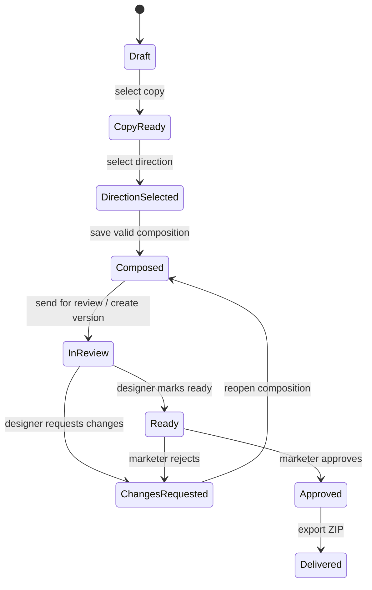
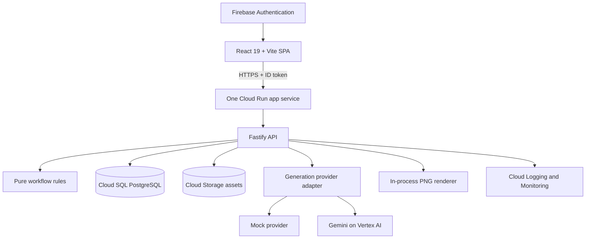

# Banner Studio Lean MVP — Product and Technical Design

**Date:** 2026-09-04  
**Status:** Approved architecture direction; written specification pending final review  
**Product:** Banner Studio  
**Deployment:** Google Cloud, `europe-west6`

## 1. Outcome

Banner Studio MVP lets an invited marketer turn a structured campaign brief into a reviewed package of static advertising banners:

1. Create and validate a brief.
2. Generate and select copy with Gemini.
3. Generate and select a visual direction with Gemini.
4. Compose the selected content in a versioned banner template.
5. Create an immutable review version.
6. Complete a human design review in Figma.
7. Approve the exact reviewed version in Banner Studio.
8. Export approved PNG files and a manifest in a ZIP.

The MVP is not a frontend demo. Campaigns, generation jobs, versions, review events, approvals, assets, and deliveries persist across sessions and deployments.

## 2. Product principles

1. **One mandatory path.** A user cannot skip required workflow states.
2. **Human review stays mandatory.** A designer reviews before a marketer approves.
3. **Approval references exact content.** Every approval points to an immutable campaign version and asset hashes.
4. **The server is authoritative.** Roles, transitions, limits, and export guards are enforced by the API.
5. **AI integrations are honest.** The UI displays whether the active provider is `mock` or `gemini`.
6. **Reviewable delivery.** Every engineering module produces a working, independently testable checkpoint.

## 3. Scope

### Included

- One workspace with invited users.
- Roles: Marketer, Designer, Admin.
- Persistent campaigns and workflow state.
- Gemini text and image generation through Vertex AI.
- A deterministic mock provider using the same adapter interface.
- Generation records, safety results, retry limits, daily cost caps, and a kill switch.
- Versioned template manifests and static banner compositions.
- Immutable campaign versions.
- Manual Figma review handoff with a stored Figma URL.
- Designer `Ready` or `Request changes` action in Banner Studio.
- Marketer `Approve` or `Reject` action in Banner Studio.
- PNG-per-ratio export in a ZIP with a JSON manifest.
- Audit events for every protected transition.
- Incremental adoption of shadcn/ui for new and modified product surfaces.
- Staging and production deployment to Google Cloud.

### Excluded

- MP4, animation, or video rendering.
- Figma plugin, webhook, automatic import, or automatic frame pull.
- Slack interactivity. A simple notification link may be added after the core flow works.
- Billing and subscriptions.
- Multiple workspaces or organisations.
- Public self-service registration.
- Freeform design editing inside Banner Studio.
- A separate render service or general background-job platform.

## 4. Users and permissions

| Role | Allowed | Not allowed |
| --- | --- | --- |
| Marketer | Create campaigns, edit briefs, generate/select content, compose, send for review, approve/reject, export | Mark a version ready, manage users or provider settings |
| Designer | Open review versions, attach a Figma URL, mark ready, request changes | Generate content, approve, export, manage settings |
| Admin | Invite users, manage provider/model allowlist and limits, use marketer capabilities | Mark a version ready unless the account is explicitly assigned the Designer role |

A user has one role in the MVP. The user who marks a version ready cannot approve that version.

## 5. Workflow and state machine



### Transition contract

| From | To | Actor | Guard | Side effect |
| --- | --- | --- | --- | --- |
| `draft` | `copy_ready` | Marketer | Valid, selected copy variant | Store selection; mark later artifacts stale if changed |
| `copy_ready` | `direction_selected` | Marketer | Selected direction has a usable image | Store selection; mark composition stale if changed |
| `direction_selected` | `composed` | Marketer | All template constraints pass | Store composition and validation result |
| `composed` | `in_review` | Marketer | No open version; safety and budget checks pass | Create immutable version N and review package |
| `in_review` | `changes_requested` | Designer | Comment is present | Append review event |
| `in_review` | `ready` | Designer | Figma URL is present and checklist confirmed | Append ready event with actor and version hash |
| `ready` | `changes_requested` | Marketer | Comment is present | Append rejection event |
| `ready` | `approved` | Marketer | Actor differs from ready actor; version is current | Append approval event with version and asset hashes |
| `changes_requested` | `composed` | Marketer | Campaign is editable | Reopen composition; next review creates N+1 |
| `approved` | `delivered` | Marketer | No existing delivery; hashes still match | Create ZIP and delivery record |

Any missing transition returns `409 transition_not_allowed`. Wrong-role actions return `403 forbidden`.

## 6. Version and review model

A `CampaignVersion` is created only by **Send for review**.

It copies, rather than references mutable values:

- selected and edited copy;
- selected visual direction and prompt;
- final image asset ID and SHA-256;
- template ID and template version;
- slot values and rendered asset IDs for each ratio;
- validation and safety results.

The version receives a canonical JSON hash. Versions and review events are append-only.

### Figma boundary

Banner Studio is the source of approved pixels in the lean MVP:

1. Banner Studio renders PNGs and a manifest for review version N.
2. The designer opens or imports them into Figma and records the Figma URL in Banner Studio.
3. The designer reviews visual quality and either requests changes or marks version N ready in Banner Studio.
4. Requested visual changes are implemented in Banner Studio templates/compositions and produce version N+1.
5. The marketer approves the exact Banner Studio assets from the ready version.
6. Delivery exports those same stored assets without re-rendering.

Automatic Figma frame retrieval is deferred until a separate technical spike proves permissions, rate limits, identity, node mapping, and failure recovery.

## 7. Lean technical architecture



### Components

| Component | Responsibility |
| --- | --- |
| Existing React/Vite app | Product UI. It calls the API and never receives provider credentials. |
| Fastify API in the same container | Authentication, roles, validation, transitions, persistence, provider calls, export endpoints, health checks. |
| `shared/contracts` | Zod schemas for API payloads, stored snapshots, template manifests, and provider results. |
| `shared/rules` | Pure transition guards, status derivation, stale propagation, limits, and canonical hashing. |
| PostgreSQL | System of record for users, settings, campaigns, jobs, versions, review events, deliveries, and audit events. |
| Cloud Storage | Generated images, review PNGs, manifests, and ZIP deliveries. Objects are private. |
| Provider adapter | Stable `mock` and `gemini` implementations returning identical validated result types. |
| In-process renderer | Produces PNGs from the shared template representation. It remains behind an interface so it can move to another service later. |
| VitePress | Team and technical documentation served under `/docs/`. |

### Deliberate simplifications

- One repository, one package, and one deployable container.
- No separate render service in the MVP.
- No Cloud Tasks initially. Provider calls use idempotency keys and persisted job records inside the request lifecycle. A queue is added only if real latency or retries require it.
- No Terraform requirement for the first module. Infrastructure is scripted and documented; infrastructure-as-code becomes a hardening task after the core flow works.
- No full rewrite to TypeScript. New shared contracts and server modules may use TypeScript only after the build supports it; existing React screens remain JavaScript during the MVP.
- Existing CSS is retained. shadcn/ui and Tailwind are adopted incrementally on new or materially changed screens.

## 8. Provider contract

The server exposes one provider interface:

```ts
interface GenerationProvider {
  generateCopy(input: GenerateCopyInput): Promise<GenerateCopyResult>
  generateDirections(input: GenerateDirectionsInput): Promise<GenerateDirectionsResult>
  generateImage(input: GenerateImageInput): Promise<GenerateImageResult>
}
```

Every result includes:

- provider and model ID;
- region;
- usage and estimated cost when available;
- safety verdict;
- schema-validated content;
- generation job ID.

Provider and model are selected from a server-controlled allowlist. Region and endpoint are deployment configuration, not arbitrary user input. Admin settings may select an allowed provider/model, set regeneration caps, set the daily budget, and activate the kill switch.

## 9. Safety and cost controls

### Checkpoints

1. **Brief:** length limits, required fields, personal-data warning, injection-pattern scan.
2. **Copy:** provider safety result, required-claim grounding, forbidden-claim check, template text limits.
3. **Image direction and output:** provider safety result; blocked output is visible but cannot be selected.
4. **Composition:** slot length, safe area, supported ratio, minimum readable size.

### Failure classes

| Code | Retry | User result |
| --- | --- | --- |
| `content_rejected` | Manual after editing | Rule-specific explanation |
| `provider_blocked` | Manual within cap | Generic safe explanation |
| `rate_limited` | One controlled retry | Temporary unavailable state |
| `provider_unavailable` | Manual retry | Provider unavailable state |
| `invalid_output` | One controlled retry | Generation failed state |
| `over_budget` | No retry | Admin must change limit |
| `kill_switch_active` | No retry | Generation temporarily disabled |

Before a paid call, the API checks authentication, the kill switch, per-step regeneration cap, daily budget, and idempotency key.

## 10. Data model

| Entity | Purpose and invariant |
| --- | --- |
| `users` | Invited identity and one role. |
| `settings` | Allowed provider/model choice, limits, budget, kill switch; admin-only. |
| `campaigns` | Brief, current status, current selections, current version number. |
| `copy_sets` | Append-only generated candidate sets; one selected candidate per campaign. |
| `visual_directions` | Generated direction records and image assets with ready/blocked/failed status. |
| `compositions` | Template version, slot values, validation result, stale flag. |
| `generation_jobs` | One row per provider call with status, model, safety, usage, cost, attempts, idempotency key. |
| `assets` | Private object location, MIME type, dimensions, SHA-256, source, campaign/version association. |
| `campaign_versions` | Immutable numbered snapshot and canonical hash. |
| `review_events` | Append-only sent/changes-requested/ready/approved/rejected/delivered history. |
| `deliveries` | One ZIP per approved version. |
| `audit_events` | Actor, role, action, entity, before/after status, version, timestamp. |

Database constraints enforce one active review version per campaign, one delivery per approved version, and unique idempotency keys per actor and endpoint.

## 11. Authentication and data location

- Firebase Authentication provides Google sign-in and email-link sign-in for invited users.
- The API verifies the Firebase ID token on every protected request.
- Roles and invitation status come from PostgreSQL, not token claims.
- App, database, storage, logs, and Vertex AI calls remain in approved EU locations, with the application resources in `europe-west6`.
- Firebase Authentication identity processing outside the EU is documented for pilot users.
- Figma and optional Slack receive review metadata only, never the full brief.

## 12. UI approach

The current interface is retained and connected to real API state one workflow section at a time.

- Existing routes and visual language remain stable unless a module explicitly changes them.
- New platform forms, dialogs, status badges, tables, and settings controls use shadcn/ui.
- Tailwind is introduced for shadcn components; existing product CSS is not mechanically rewritten.
- Canonical screen states are `loading`, `empty`, `success`, `error`, `retry`, `blocked`, `rejected`, `stale`, `over_budget`, and `provider_unavailable`.
- Every module includes keyboard, focus, label, and responsive checks for the surfaces it changes.

## 13. API boundary

The public application API is versioned under `/api/v1`.

Core resources:

- `/session` and `/users`
- `/settings`
- `/campaigns`
- `/campaigns/:id/copy`
- `/campaigns/:id/directions`
- `/campaigns/:id/composition`
- `/campaigns/:id/versions`
- `/versions/:id/review-events`
- `/versions/:id/delivery`
- `/assets/:id`

Mutating requests include an `Idempotency-Key`. Error responses use `{ code, message, details?, requestId }`.

## 14. Modular development and review gates

Each module is a separate commit series and review checkpoint. Work does not proceed to the next module until its tests and acceptance check are visible.

### Module 0 — Contracts and rules

Produces Zod schemas, the status enum, transition guards, canonical hashing, a pilot fixture, and contract tests. No backend or UI behavior changes.

**Review checkpoint:** inspect schemas and run deterministic rule tests.

### Module 1 — Local API and persistence

Produces the Fastify server, PostgreSQL migrations, health endpoints, campaign CRUD, settings storage, and the mock provider. The existing UI remains usable.

**Review checkpoint:** create a campaign through the API, restart the service, and confirm it persists.

### Module 2 — Authentication and roles

Adds Firebase token verification, invitation checks, role enforcement, and audit events.

**Review checkpoint:** demonstrate allowed and refused actions for Marketer, Designer, Admin, and an uninvited user.

### Module 3 — Gemini generation

Adds the Vertex AI adapter, generation jobs, safety mapping, caps, budget checks, kill switch, and real copy/image generation.

**Review checkpoint:** run one campaign through copy and visual selection; inspect provider, model, region, safety, and cost records.

### Module 4 — Templates and immutable review versions

Connects compositions to versioned manifests, validates ratios/slots, renders PNGs, stores assets, and creates immutable versions.

**Review checkpoint:** compare preview and stored review PNGs; verify a changed composition creates N+1.

### Module 5 — Human review and delivery

Adds Figma URL handoff, request-changes/ready/approve/reject actions, self-approval protection, and ZIP export.

**Review checkpoint:** complete both happy and rejection paths and inspect the audit/version history.

### Module 6 — UI states and shadcn adoption

Connects the existing workflow screens to the API, adds settings and identity surfaces, and ports only touched primitives to shadcn/ui.

**Review checkpoint:** review every canonical screen state on desktop and mobile and complete keyboard checks.

### Module 7 — Cloud deployment and pilot hardening

Adds staging/production configuration, secrets, backups, alerts, smoke tests, rollback runbook, and pilot metrics.

**Review checkpoint:** deploy a tagged build, run one real campaign, trigger a test alert, and rehearse rollback.

## 15. Testing strategy

| Layer | Coverage |
| --- | --- |
| Unit | Transitions, guards, hashing, stale rules, limits, template validation |
| Contract | Zod schemas, valid/invalid fixtures, API payloads, provider output |
| API integration | PostgreSQL persistence, roles, transition table, idempotency, invariants |
| Component | Canonical states and workflow actions with Testing Library |
| End to end | Happy path and rejection path with mock provider; one staging run with Gemini |
| Accessibility | Automated checks plus manual keyboard/focus review on changed surfaces |
| Operational | Health checks, backup restore, alert test, deployment rollback |

Live model output is tested by properties—schema, limits, locale, policy verdict—not exact string equality.

## 16. MVP acceptance criteria

The MVP is ready for a controlled pilot when:

- invited users can sign in and are restricted by role;
- a campaign survives reload and deployment;
- real Gemini copy and image generation works through the server;
- every paid call has a job, safety result, and cost record;
- budgets, caps, and the kill switch prevent calls before spend;
- the marketer cannot skip required states;
- Send for review creates an immutable version and review package;
- a designer can request changes or mark the version ready;
- the ready actor cannot approve the same version;
- only an approved version can produce a delivery ZIP;
- exported bytes match stored asset hashes;
- the mock provider still supports deterministic tests and demos;
- documentation identifies every integration as mock, live, or deferred;
- one staging deployment, alert test, backup restore, and rollback rehearsal succeed.

## 17. Post-MVP triggers

Add deferred infrastructure only when evidence justifies it:

| Trigger | Addition |
| --- | --- |
| Provider calls exceed the reliable request lifecycle or need scheduled retries | Cloud Tasks queue |
| Rendering causes app memory/latency problems | Separate render service |
| Manual Figma handoff causes repeated review errors | Figma read-only pull spike, then integration if successful |
| More than one client workspace is required | Workspace tenancy and billing design |
| Static pilot proves value and motion has a defined source | MP4 manifest and renderer design |

## 18. Explicit decisions

- The lean architecture replaces the heavier two-service, queue-first proposal for the MVP.
- Banner Studio assets, not Figma exports, are the source of approved pixels in the MVP.
- One Cloud Run service is the initial deployable unit.
- PostgreSQL and Cloud Storage are required from Module 1.
- Gemini is real in the MVP; the mock provider remains for tests and demos.
- PNG ZIP is the only delivery format.
- Development is reviewed module by module before the complete system is finished.
